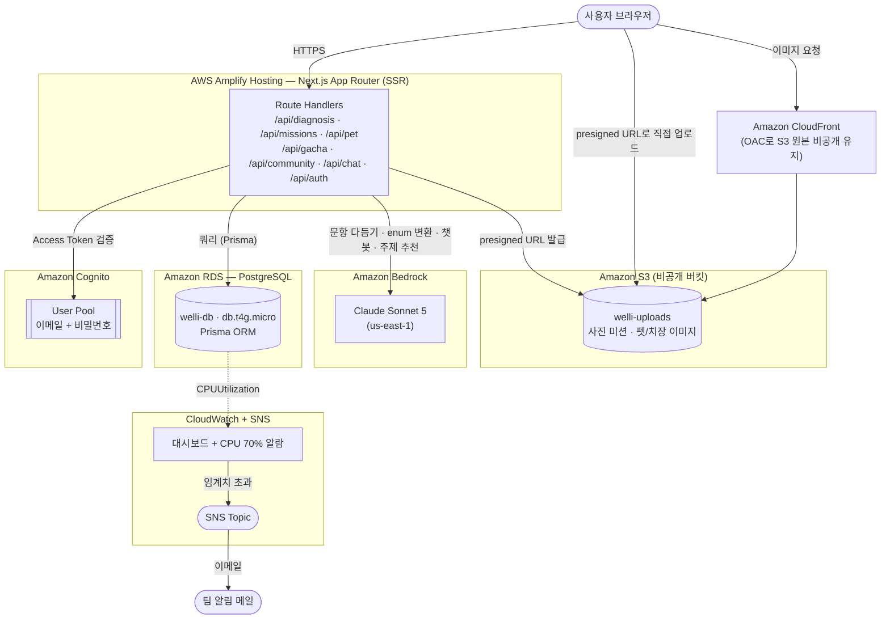
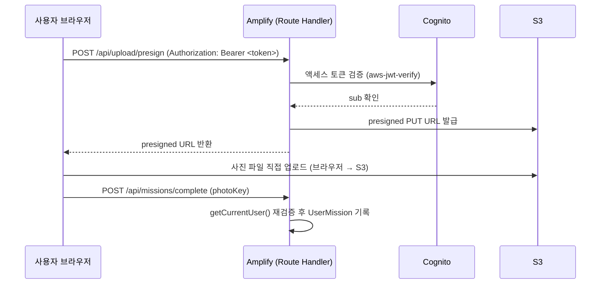

# 시스템 아키텍처

기준일: 2026-08-19. 기능 명세는 `SPEC.md` 10절, 실제 리소스는 이 문서에서 관리한다.
발표 자료·심사 질문 대응(`SPEC.md` 13절)에 이 문서를 그대로 쓸 수 있다.

---

## 1. 전체 구조

**핵심 설계**: 서버 로직은 전부 Next.js Route Handler 하나로 모은다. API Gateway·Lambda를 별도 레포로 쪼개지 않아 5인 비개발자 팀이 배포 파이프라인을 하나만 이해하면 된다. Amplify Hosting이 이 Route Handler를 서버리스 컴퓨트(Lambda 기반)로 실행하고, `main` push 시 자동 배포한다.

---

## 2. 구성 요소와 실제 리소스

| 서비스 | 리소스 | 용도 | 심사 설명 포인트 |
|---|---|---|---|
| Amplify Hosting | app `welli` (**`d2ynoyp44lt46h`**) | Next.js 빌드·배포·HTTPS, `main` push 자동 배포 | 서버리스 SSR, 유휴 비용 0 |

> **app id 정정 (2026-08-22).** 이 줄에 `d36bhb2dnkr0oj`로 적혀 있었다. 실제로 배포가 도는 앱은
> `d2ynoyp44lt46h`다 — 라이브 URL `https://main.d2ynoyp44lt46h.amplifyapp.com`이 그 앱이고
> (`docs/기능체크리스트.md`, `docs/dev/diagnosis.md`의 프로덕션 검증 기록),
> `app/layout.tsx:40`의 `APP_ORIGIN` 폴백도 같은 값이다. `d36bhb2dnkr0oj`는 CLI로 먼저 만들었다가
> GitHub를 연결하지 않은 앱이다. `docs/dev/infra.md` 49·51·55행에도 옛 id가 남아 있다.
| RDS PostgreSQL | `welli-db`, `db.t4g.micro`, PG 16.4 | 애플리케이션 데이터 전체, Prisma ORM | ARM(`t4g`) 인스턴스로 비용 최적화, 자동 백업 7일 |
| Cognito | User Pool `us-east-1_EhWWTXiQJ` | 이메일+비밀번호 인증, 인증코드 비활성 | 인증·토큰 관리를 관리형 서비스에 위임 |
| Bedrock | `us.anthropic.claude-sonnet-5` (us-east-1) | 진단 문항 다듬기, 자유 답변→enum 변환, 챗봇, 커뮤니티 주제 추천 | 모델 단일화로 호출 경로·버그 표면 최소화 |
| S3 | `welli-uploads-185236887369` (비공개) | 사진 미션 업로드, 펫·치장 이미지 원본 | 퍼블릭 액세스 완전 차단, presigned URL로만 입출력 |
| CloudFront | 배포 `E384TUNL0Z75C5` (`diros91hbap9v.cloudfront.net`) | S3 정적 자원 CDN | OAC로 S3를 비공개로 유지한 채 캐싱·HTTPS 제공 |
| CloudWatch + SNS | 대시보드 `welli-dashboard`, 알람 `welli-rds-cpu-high` | RDS CPU·연결수·스토리지·메모리 모니터링, CPU 70% 알람 | 운영 모니터링 체계 보유 |

서버 로직은 Next.js Route Handler로만 구현한다. **EC2, Docker, Lambda 단독 배포, EventBridge, API Gateway, WAF, Secrets Manager는 채택하지 않았다** — 이해 가능성·버그 발생률·8일 개발 기간 안정성을 기준으로 제외했다.

---

## 3. 인증·요청 흐름 예시 — 사진 미션 업로드

브라우저가 S3에 직접 업로드하므로 서버가 파일 바이너리를 중계하지 않는다. Bedrock 비전 판정은 하지 않고, 업로드 성공 자체를 미션 달성으로 인정한다(`SPEC.md` 4절).

---

## 4. 보안 설명 카드

- **인증**: Cognito 관리형 사용자 풀, 액세스 토큰을 API 요청마다 검증(`lib/auth.ts`)
- **전송 계층**: Amplify Hosting·CloudFront 전 구간 HTTPS 강제
- **DB 접근**: Prisma parameterized query로 SQL Injection 차단
- **파일 접근**: S3 버킷은 퍼블릭 액세스 완전 차단, CloudFront는 OAC로만 원본 접근, 사용자 업로드·조회는 presigned URL 한정
- **IAM**: 리소스별 최소 권한 정책 (RDS/S3/Cognito/Bedrock 개별 접근)
- **예외 — RDS 네트워크**: 5인 팀이 로컬 PC에서 직접 `DATABASE_URL`로 개발해야 해서 RDS를 Publicly Accessible=true로 설정하고 5432 포트를 강력한 마스터 비밀번호로만 방어했다. 부트캠프 데모 프로젝트(실사용자 없음)라는 전제로 내린 결정이며, **발표 전 팀 재검토 대상**이다 (`docs/dev/infra.md` 참고)

---

## 5. 비용·트래픽 최적화 설명 카드

- Amplify Hosting 서버리스 SSR → 요청이 없을 때 유휴 비용 0
- RDS `db.t4g.micro`(ARM) → 동급 x86 대비 비용 절감
- 정적 자원(S3)과 동적 렌더링(Amplify)을 분리해 CloudFront 캐싱 효율 확보
- Bedrock 모델을 Claude Sonnet 5 단일로 고정 → 모델 분기·요금 추적 단순화
- DB 커넥션은 Prisma 커넥션 풀로 제한해 동시 접속 급증에 대비

---

## 6. 남은 일

- Amplify ↔ GitHub 연동 (브라우저 OAuth, `docs/dev/infra.md` 참고)
- RDS 네트워크 노출 재검토 (4절 참고)
- 발표 슬라이드용으로 이 문서의 다이어그램을 캡처해 사용 가능
